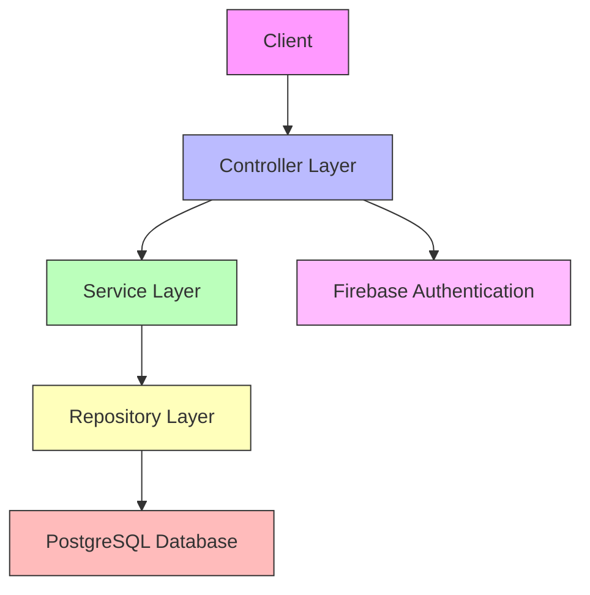

# RoomEase Backend

Here's comprehensive content for your README.md file:

---

## 📋 Project Overview

**RoomEase Backend** is a Spring Boot-based REST API for managing hostel room maintenance and facilities. The application provides a comprehensive ticket management system for students to report and track various hostel issues including AC problems, cleaning requests, electrical issues, and plumbing problems.

## 🏗️ Architecture

The application follows a **layered architecture pattern** with clear separation of concerns:



### Architecture Layers:

1. **Controller Layer** - REST API endpoints for client interactions [1](#0-0) 

2. **Service Layer** - Business logic and data processing [2](#0-1) 

3. **Repository Layer** - Data access and persistence operations [3](#0-2) 

4. **Model Layer** - Entity definitions and data structures [4](#0-3) 

5. **DTO Layer** - Data Transfer Objects for API communication [5](#0-4) 

6. **Configuration Layer** - Application and security configurations [6](#0-5) 

## 🛠️ Tech Stack

### Core Framework
- **Java 23** - Programming language [7](#0-6) 
- **Spring Boot 3.4.2** - Application framework [8](#0-7) 

### Database
- **PostgreSQL** - Relational database for data persistence [9](#0-8) 
- **Spring Data JPA** - Data access abstraction [10](#0-9) 

### Authentication & Security
- **Firebase Admin SDK** - Authentication and user management [11](#0-10) 

### Development Tools
- **Lombok** - Reduces boilerplate code [12](#0-11) 
- **Gradle** - Build automation tool [13](#0-12) 

### Testing
- **JUnit Platform** - Testing framework [14](#0-13) 

## ✨ Key Features

### 1. User Management
The system supports three types of users with role-based access:
- **Students** - Create and track maintenance tickets
- **Admins** - Manage overall system operations
- **Hostel Managers** - Oversee hostel-specific operations [15](#0-14) 

User information includes: [16](#0-15) 

### 2. Ticket Management System
Comprehensive maintenance ticket system supporting multiple categories:

- **Cleaning Tickets** - Room cleaning requests
- **Electrical Tickets** - Electrical issue reporting
- **Plumbing Tickets** - Plumbing problem reports
- **AC Tickets** - Air conditioning maintenance [17](#0-16) 

Each ticket tracks: [18](#0-17) 

### 3. Authentication
Firebase-based authentication with token verification: [19](#0-18) 

### 4. Warden Management
Entry tracking and management for warden duties: [20](#0-19) 

## 🌐 API Endpoints

### Authentication
- `POST /auth/verifyToken` - Verify Firebase authentication tokens

### User Management
- `POST /createUser` - Create new user
- `POST /io` - Update user details

### Task Management
- `POST /api/tasks/create` - Create maintenance ticket
- `PUT /api/tasks/close/{firebaseUid}/{category}` - Close a ticket [21](#0-20) 

### Warden Operations
- `PUT /entry` - Record warden entry details

## 🗄️ Database Schema

The application uses PostgreSQL with JPA entities following an inheritance strategy for tickets: [22](#0-21) 

**Main Tables:**
- `users` - User information and credentials
- `tickets` - Base ticket information with inheritance for specialized ticket types

## 🚀 Deployment

The application is configured for deployment on Render with Firebase credential management: [23](#0-22) 

## 📦 Project Structure

```
src/main/java/com/example/roomeasebackend/
├── config/           # Application configurations
├── controller/       # REST API endpoints
├── dtos/            # Data Transfer Objects
├── model/           # JPA entities
├── repository/      # Data access layer
└── service/         # Business logic layer
```

## 🔧 Setup & Installation

### Prerequisites
- Java 23 or higher
- PostgreSQL database
- Firebase project with service account credentials
- Gradle

### Environment Configuration
1. Set up PostgreSQL database
2. Configure Firebase service account key
3. Place `serviceAccountKey.json` in resources folder or configure for Render deployment

### Build & Run
```bash
# Build the project
./gradlew build

# Run the application
./gradlew bootRun
```

## 📝 Notes

- The application uses UUID for primary keys across all entities
- Firebase UID is used as the unique identifier for user authentication
- Ticket system uses JPA inheritance strategy for different ticket types
- SSL certificate support included for secure database connections [24](#0-23) 

---

This README provides a comprehensive overview of your backend architecture, tech stack, and features. You can customize sections based on additional details or specific requirements for your project documentation.
